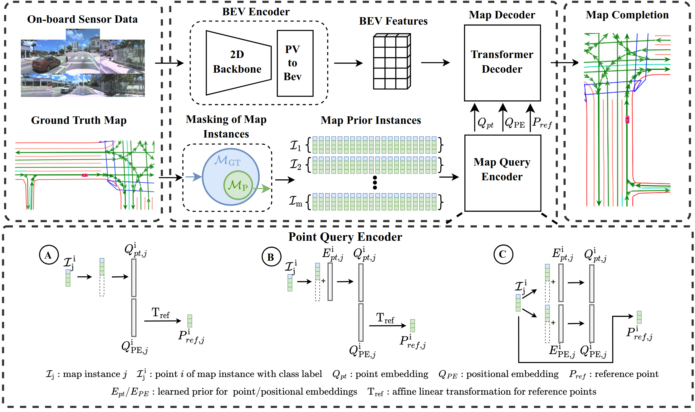
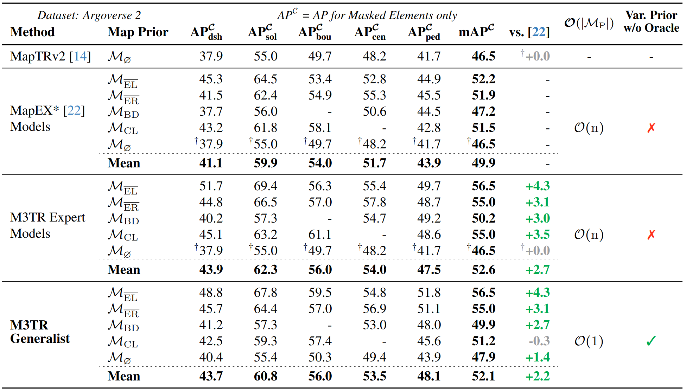
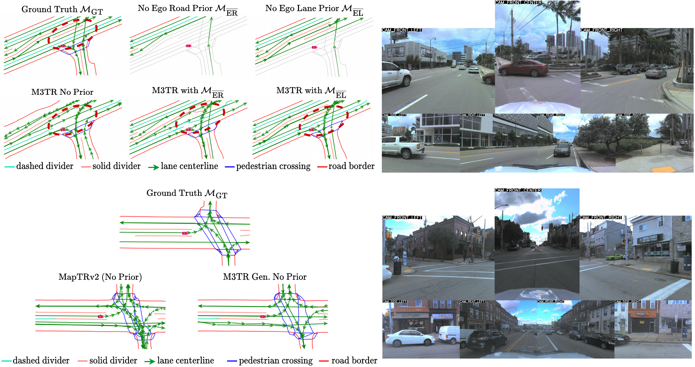

# M3TR: Generalist HD Map Construction with Variable Map Priors

[Fabian Immel](https://scholar.google.com/citations?hl=de&user=uHlmd9QAAAAJ&view_op=list_works&sortby=pubdate)<sup>1 :email:</sup> , [Richard Fehler](https://scholar.google.com/citations?hl=de&user=gOQYH4AAAAAJ&view_op=list_works&sortby=pubdate)<sup>1</sup> , [Frank Bieder](https://scholar.google.com/citations?user=mAMWuMUAAAAJ&hl=de&oi=ao)<sup>1</sup> , [Jan-Hendrik Pauls](https://scholar.google.com/citations?user=0LbD7HUAAAAJ&hl=de&oi=ao)<sup>2</sup> , [Christoph Stiller](https://scholar.google.com/citations?user=OeAQ2c0AAAAJ&hl=de&oi=ao)<sup>2</sup>
 
<sup>1</sup> FZI Research Center for Information Technology <sup>2</sup> Institute for Measurement and Control Systems, Karlsruhe Institute of Technology

(<sup>:email:</sup>) corresponding author

### [Project Page :globe_with_meridians:](https://immel-f.github.io/m3tr/)

### [ArXiv Preprint](https://arxiv.org/abs/2411.10316)

Official implementation of `M3TR: Generalist HD Map Construction with Variable Map Priors`

## Introduction



Autonomous vehicles require road information for their operation, usually in form of HD maps. Since offline maps eventually become outdated or may only be partially available, online HD map construction methods have been proposed to infer map information from live sensor data. A key issue remains how to exploit such partial or outdated map information as a prior. We introduce M3TR (Multi-Masking Map Transformer), a generalist approach for HD map construction both with and without map priors. We address shortcomings in ground truth generation for Argoverse 2 and nuScenes and propose the first realistic scenarios with semantically diverse map priors. Examining various query designs, we use an improved method for integrating prior map elements into a HD map construction model, increasing performance by +4.3 mAP. Finally, we show that training across all prior scenarios yields a single Generalist model, whose performance is on par with previous Expert models that can handle only one specific type of map prior. M3TR thus is the first model capable of leveraging variable map priors, making it suitable for real-world deployment. 

### Results on Argoverse 2 Geo Split (see [paper](https://arxiv.org/abs/2411.10316) for full evaluation)



### Qualitative Results on Argoverse 2 Geo Split



## Model Checkpoints

You can find the trained checkpoints of the Generalist model on Argoverse 2 and nuScenes [here](https://drive.google.com/drive/folders/1pUVveoMSVK5OuFzregQs1EuUMSJwEcik?usp=sharing)

## Basic Usage

The environment can be found in the Dockerfile in the folder, simply build the corresponding docker image, which will contain dependencies and a copy of this codebase.

The code follows the structure of the MapTRv2 codebase, so the basic workflow is similar. 
After downloading the Argoverse 2 or nuScenes dataset, you need to create the labels for training:

```
python tools/m3tr/custom_av2_map_converter.py --data-root /datasets/public/argoverse20/sensor --out-root ./gen_labels/argoverse2_no_map_prior --masked-elements boundary centerline divider_dashed divider_solid ped_crossing
```

*(nuScenes command similar)*

The main difference in usage here compared to MapTR is the `--masked-elements` flag with which you specify the elements that are not included in the map prior. The above command would therefore generate labels without any prior, equivalent to the ones for the pure online HD map construction task.

`--masked-elements` accepts either a list of element types as above or special flags. Those are:
- `ego_lane`: masks out all labels associated with the ego lane
- `ego_road`: masks out all labels associated with the ego road
- `random`: randomly selects a masking type for a sample
- `random_whole_dataset`: duplicates each sample for each available masking type (e.g. 8 masking types = 8x the dataset annotations stacked, once for each masking type)


The model configs for different Expert models are the same, you control what type Expert is trained by the generated labels. Thus you need to change the directory in the `ann_root` field in the config depending on your generated labels and their output path.

When you pass `random_whole_dataset` as a flag for `--masked-elements`, that generates the labels for the Generalist model.

**Note:** The labels generated in this way follow the default split from MapTRv2. To mirror the evaluation in the paper and use the geographic split, follow the instructions in [geographical-splits](https://github.com/LiljaAdam/geographical-splits) for MapTRv2.

To train a model, use the `dist_train.sh` script: 

```
./tools/dist_train.sh ./projects/configs/m3tr/m3tr_av2_3d_r50_54ep_generalist.py 4
```

This command would train the generalist model for Argoverse 2 on 4 GPUs.

## Acknowledgements

We're grateful for the open-source codebase of MapTRv2, which formed the basis for our project:

* [MapTRv2](https://github.com/hustvl/MapTR/tree/maptrv2) 